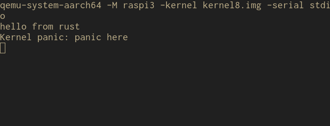

这是 raspi-os 的第三篇，主要想要设置好 qemu 中的 uart，方便开发和调试。

## UART

可以理解为是一种用于信息传输用的硬件，见[维基百科](https://zh.wikipedia.org/wiki/UART)

在树莓派 3b 里面，有两个相关硬件，一个是 mini uart，另一个是 PL011 UART。

有了硬件支持，我们必须编写代码让它们工作，这里分为两个部分，第一部分是直接使用 qemu 的实现，在模拟器中调用，获取输出，方便 debug;第二部分是真正实现 UART，完成后，我们可以让它在真机上运行起来。

## 第一部分 qemu 模拟器中的 UART

qemu 已经实现 UART，因此我们直接使用 PL011 的 UART 地址，往对应的地址写数据即可模拟数据发送了。

在 qemu 的源码中，我们可以找到一个 magic number：`0x3F20_1000`，即模拟器模拟树莓派的物理地址，往这个物理地址写数据，即等同于通过 uart 进行数据发送。

然后在启动 qemu 时，加上参数 `-serial stdio`，就能够在控制台输出数据了。

如图： 

### 实现记录

整体实现是基于 https://github.com/rust-embedded/rust-raspi3-OS-tutorials 这里的教程进行修改。

采用最小可运行代码的原则，删去了大部分代码，仅保留了最小的可运行代码部分。

值得注意的是，因为使用到了 `0x3F20_1000` 这个常量，我们必须在 linker script 中编写 `.rodata` 这个section，否则常量是没有地方放的，会导致程序无法运行。

另外从这里开始，我修改了汇编代码，汇编代码中自定义了 section，然后也同样在 linker script 中进行了声明。

代码放在： https://github.com/chux0519/raspi-os/tree/step2

至此，代码量还是非常小，不过好歹让程序运行起来，并且有输出了。

## 第二部分 实现 UART

要想我们的程序在真机上能够运行，还需要真正实现 UART 才行。就需要我们阅读技术手册，GPIO 部分，控制他们的实现，完成 UART。

### 技术手册

网上公开的资料比较难找到 bcm2837(raspi3b) 的资料，大多都是 bcm2835 的资料。然而一番搜索后，发现 stanford 大学的 cs140e 课程，对资料做了更新，提供了 [bcm2837](https://web.archive.org/web/20190407101616/https://cs140e.sergio.bz/docs/BCM2837-ARM-Peripherals.pdf) 的资料。

两个芯片的主要区别在于 GPIO 的物理基址，bcm2835 是 0x20000000，而 bcm2837 是 0x3F000000

### 几个地址

技术手册中提到了几个概念，这里是我对这些概念的概括（可能存在偏差，欢迎指正）

- 物理地址：即芯片真实的地址。
- 虚拟地址：即 MMU 映射的 4GB 虚拟地址空间，通常是给各个程序使用(CPU访问)
- 总线地址(bus address)：即 video core 映射的芯片总线的地址，主要映射 IO 口，SD 卡等等的地址（DMA操作 RAM 不需要通过 CPU，因此要通过总线）

即，软件要用到的是物理地址或是虚拟地址，DMA 机制使用到的地址必须是总线地址。

这里对技术手册中的地址做一些总结 ：

1. 物理地址： 0x00000000 - 0x04000000 (64K)
2. 虚拟地址，在 kernel 模式下，用到了 0xC0000000 - 0xEFFFFFFF;在用户模式下，一般用 0x00000000 - 0xBFFFFFFF。外设所映射到的虚拟地址基址是 0xF2000000 。即物理地址 0x3F000000 对应的虚拟地址基址是 0xF20000000 。
3. 总线地址，在总线中，GPIO 的基址是 0x7E000000

因此可以看出：对于 GPIO 来讲，总线 0x7Exxxxxx 对应虚拟地址 0xF2xxxxxx，对应物理地址 0x3Fxxxxxx

### mini uart / pl011

树莓派上有两个支持 uart 的设备，一个是 mini uart(uart1)，另一个是 pl011(uart0)。

查询手册后发现，两者的主要区别是，mini uart 波特率固定，吞吐量有限。

但 mini uart 的实现更简单，只需要操作一些相关的寄存器和相关 GPIO 即可。这里优先实现 mini uart。
